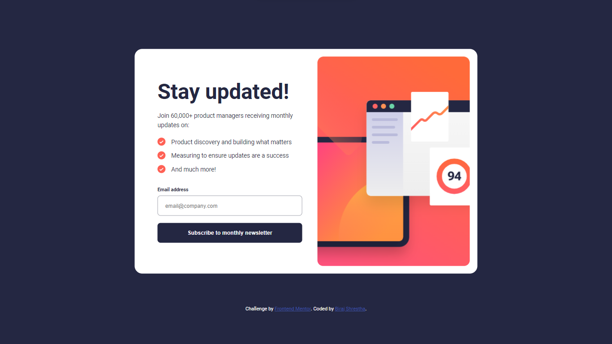
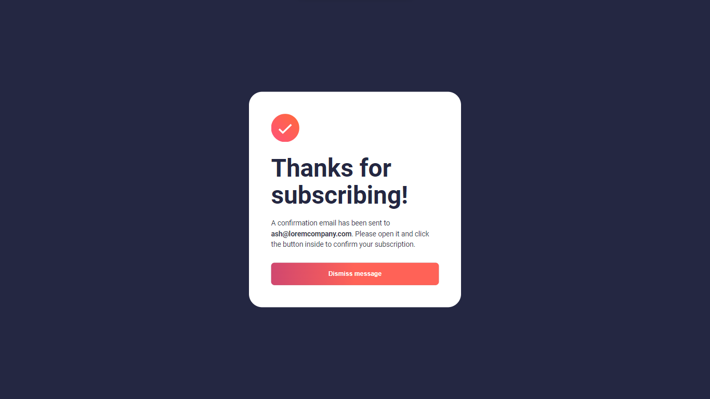
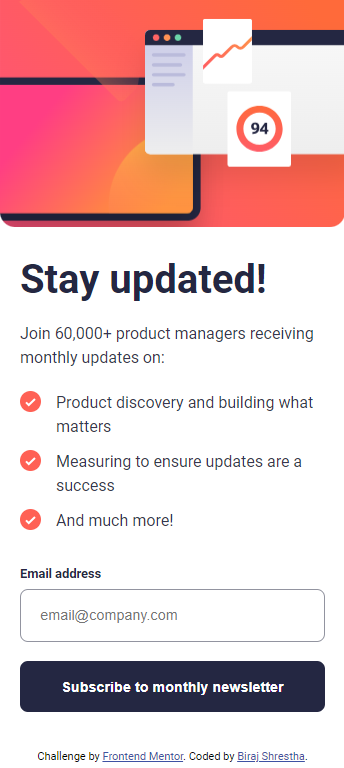
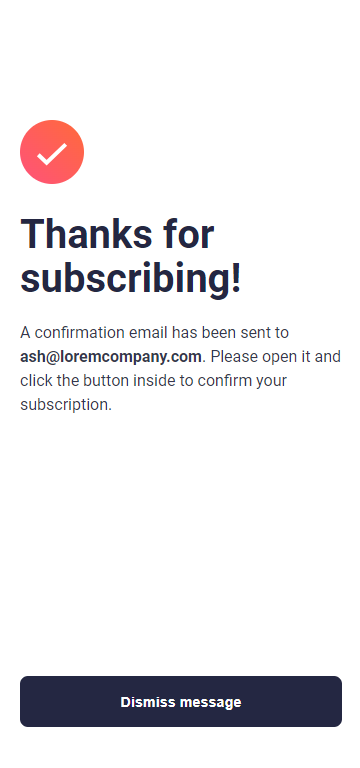

# Frontend Mentor - Newsletter sign-up form with success message solution

This is a solution to the [Newsletter sign-up form with success message challenge on Frontend Mentor](https://www.frontendmentor.io/challenges/newsletter-signup-form-with-success-message-3FC1AZbNrv). Frontend Mentor challenges help you improve your coding skills by building realistic projects.

## Table of contents

- [Overview](#overview)
  - [The challenge](#the-challenge)
  - [Screenshot](#screenshot)
  - [Links](#links)
- [My process](#my-process)
  - [Built with](#built-with)
  - [What I learned](#what-i-learned)
- [Author](#author)

## Overview

### The challenge

Users should be able to:

- Add their email and submit the form
- See a success message with their email after successfully submitting the form
- See form validation messages if:
  - The field is left empty
  - The email address is not formatted correctly
- View the optimal layout for the interface depending on their device's screen size
- See hover and focus states for all interactive elements on the page

### Screenshot







### Links

- Solution URL: [Add solution URL here](https://github.com/Sthabiraj/Newsletter-sign-up-form)
- Live Site URL: [Add live site URL here](https://sthabiraj.github.io/Newsletter-sign-up-form/)

## My process

### Built with

- Semantic HTML5 markup
- CSS custom properties
- Flexbox
- Mobile-first workflow

### What I learned

```html
<figure>
  <div class="image"></div>
</figure>
```

```css
.container .image {
  background: url(./assets/images/illustration-sign-up-mobile.svg);
  border-radius: 0 0 15px 15px;
  background-size: cover;
  width: 100%;
  height: 30vh;
  background-repeat: no-repeat;
}
```

```js
function checkEmail(event) {
  event.preventDefault(); // Prevent the default form submission behavior

  var pattern = /^[^\s@]+@[^\s@]+\.[^\s@]+$/;
  var isValidEmail = pattern.test(email.value);
  if (isValidEmail) {
    success.classList.add("active");
    email.value = "";
    body.classList.add("overflow");
    email.classList.remove("error");
    message.classList.remove("error");
  } else {
    email.classList.add("error");
    message.classList.add("error");
  }
}
```

## Author

- Website - [Biraj Shrestha](https://sthabiraj.github.io/My-Portfolio/)
- Frontend Mentor - [@Sthabiraj](https://www.frontendmentor.io/profile/Sthabiraj)
